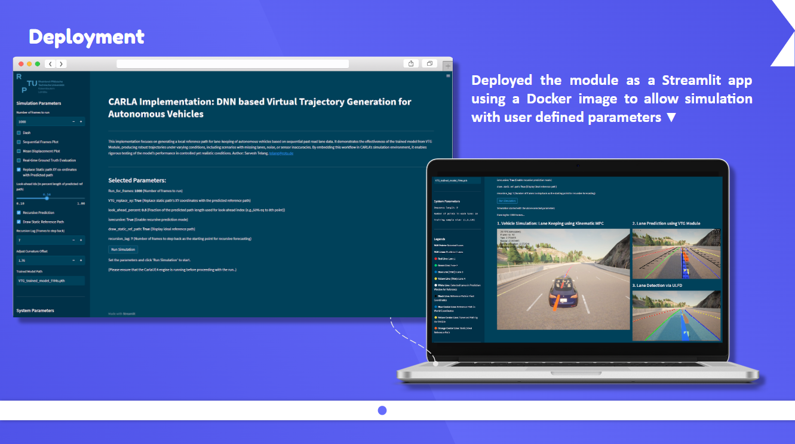
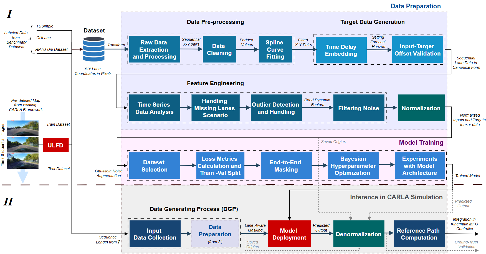
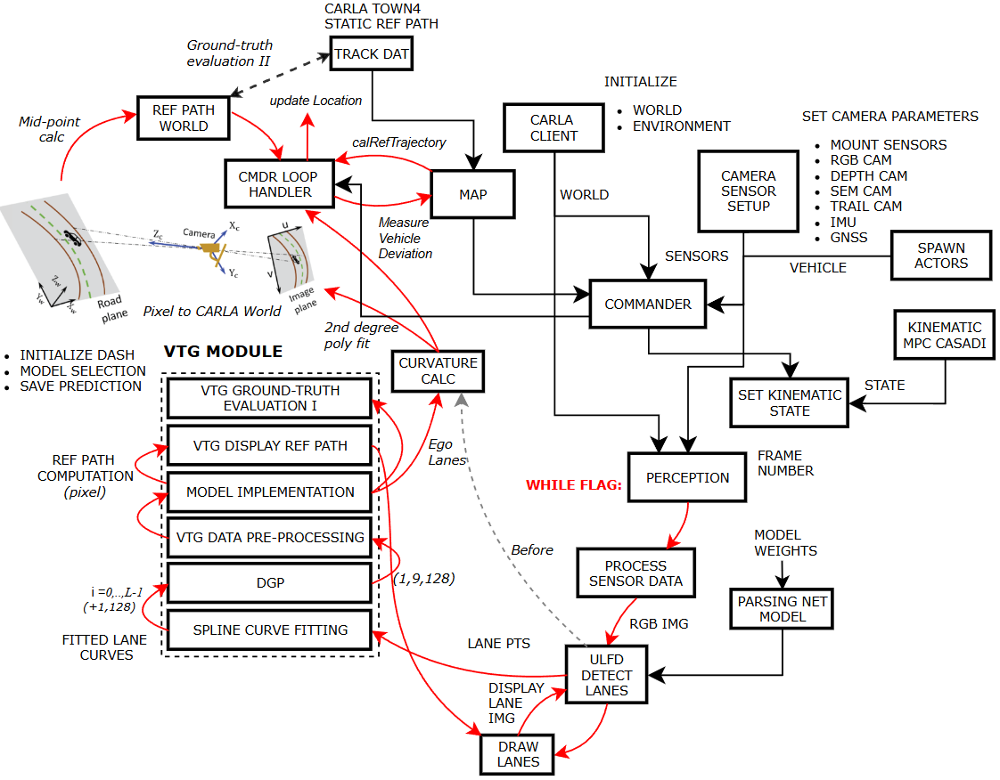

# DNN based Virtual Trajectory Generation for Autonomous Vehicles: Focus on Local Reference Path Computation

This implementation showcases a vehicle lane-keeping simulation, where the vehicle detects lanes, predicts future lane co-ordinates in real-time, and generates a local reference path using a DNN-based model. The model is trained on spatio-temporal road inference data, utilizing sequential past road frames. Developed as part of my master’s thesis, this work demonstrates the effectiveness of the VTG Framework in generating robust trajectories, even under challenging conditions such as missing lanes, noise, or sensor inaccuracies. Integrated into the CARLA simulation environment, the framework allows for comprehensive evaluation of the model’s performance in a controlled yet realistic setting.
  
- **Orange Line**: Static reference path representing the ideal trajectory the vehicle is expected to follow.
- **Blue Line**: Local reference path generated by the DNN model, which the vehicle attempts to follow (Predicted trajectory in world coordinate system used as input for Model Predictive Control).
- **Yellow Line**: Actual vehicle trajectory after computing deviation from the input local reference path.
- **RGB Dotted Lines**: Detected lanes in real time.
- **RGB Solid Lines**: Predicted lanes based on a sequence of frames.
- **Black Lines**: Mid-trajectories for each predicted lane in the 2D pixel coordinate system (used as candidate paths for the collision avoidance system).

Vehicle Simulation Video: https://seafile.rlp.net/lib/7e890b82-073a-400a-8e59-0bb07fe0a2ae/file/Lane_Prediction_1_LH0.5.mp4

Author: Sarvesh Telang. telang@rptu.de

Master Thesis Project 2024-25, RPTU Kaiserslautern-Landau

Grade: 1,3

Full Presentation link 👉: https://docs.google.com/presentation/d/1HoLhIgqfdFuED79aQlcHuO7k5kiOAdsydei2ea-_nUM/edit?usp=sharing

More Videos: https://seafile.rlp.net/library/7e890b82-073a-400a-8e59-0bb07fe0a2ae/VTG_Vehicle_Simulation_Videos/

The following figures provide an overview of the overall pipeline of the work.

============================================================================================

Previous work:

Image based lane detection is performed using DNN model based on Ultra Fast Structure-aware Deep Lane Detection. Link: https://arxiv.org/abs/2004.11757 

Lane keeping is based on Kinematic iMPC framework: S. A. Hiremath, P. K. Gummadi and N. Bajcinca, "Image based Model Predictive Controller for Autonomous Driving". Link: https://ieeexplore.ieee.org/document/10185808
